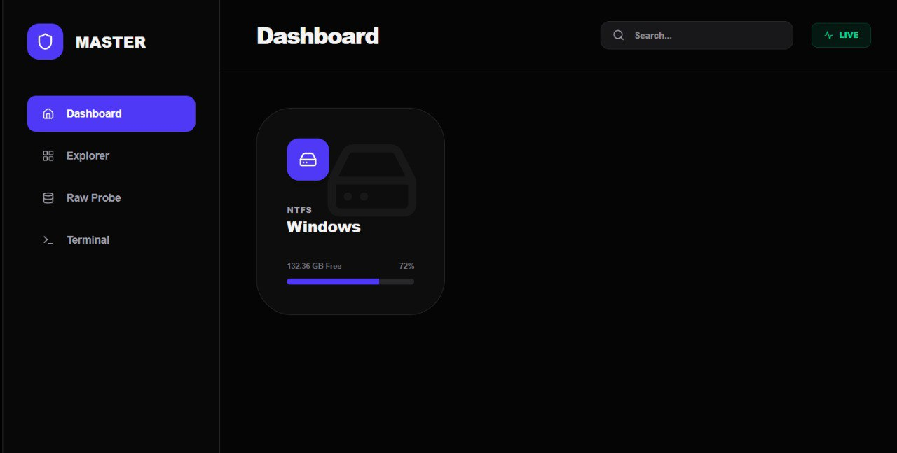
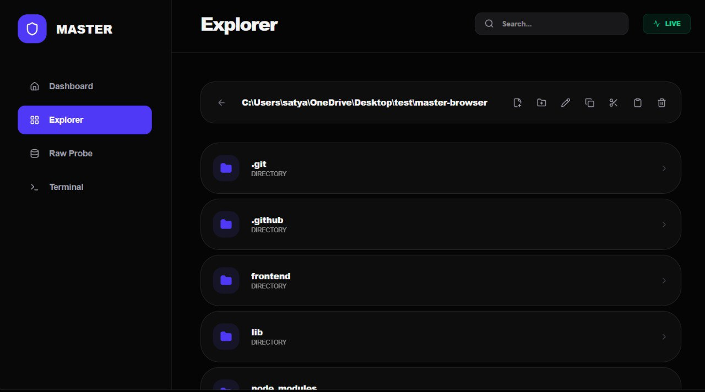
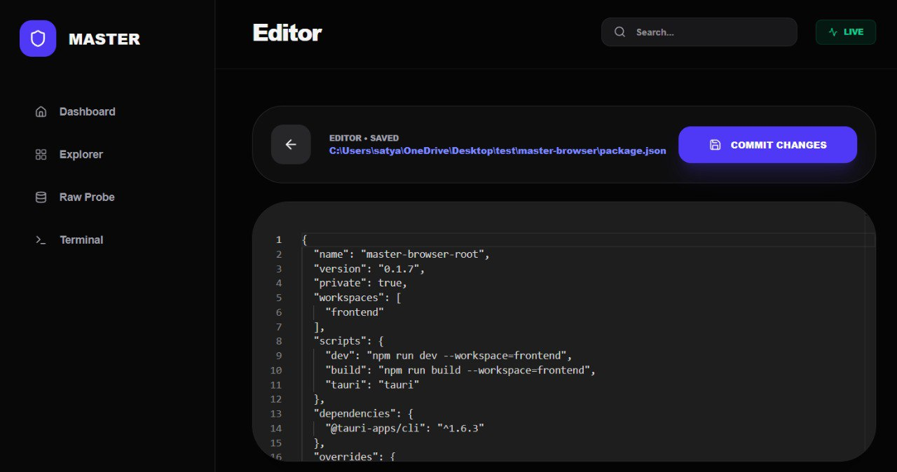
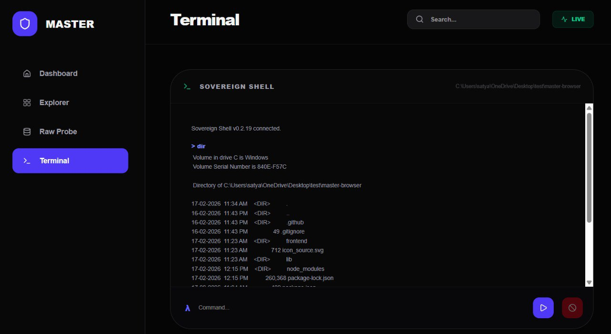

<div align="center">
  
  <h1>Master Browser</h1>
  <p><b>Universal User-Space Filesystem Bridge (Tauri + Rust)</b></p>
  <p><i>Explore and operate across NTFS/FAT/ext-family style storage from one hardened desktop UI.</i></p>
</div>

---

## What is Master Browser?

**Master Browser** is a native desktop file operations app built with **Rust + Tauri + Next.js**. It bridges the gap between operating systems, allowing you to access, read, and **edit** files on partitions (like Linux Ext4) that your host OS (like Windows) cannot normally mount.

No mock data. No simulations. Real userspace drivers.

---

## 📸 Screenshots

> Place screenshots in `docs/images/` with these exact names.

| Dashboard | Explorer |
| :---: | :---: |
|  |  |

| Editor | Terminal |
| :---: | :---: |
|  |  |

---

## ✅ Comprehensive Feature List

### 1. 🛡️ Raw Probe & Cross-OS Bridge
- **Universal Detection**: Identifies physical block devices and parses partition tables userspace (bypassing OS mounting).
- **Ext4 on Windows**: 
  - **Read**: Browse unmounted Ext4 partitions directly.
  - **Edit**: Open files from raw Ext4 partitions, edit them, and save changes back to disk without Linux.
  - **Userspace Driver**: Powered by `ext4_rs` crate integration.
- **Signature Recognition**: Detects NTFS, exFAT, Btrfs, and XFS signatures and metadata.
- **Mount Handoff**: Intelligent "Open Mount" button if the partition is already mounted by the OS.

### 2. 📂 Filesystem Explorer
- **Navigation**: Direct path input, parent navigation, and breadcrumbs.
- **Drag & Drop**: Drop files/folders onto the window to instantly jump to their location.
- **Operations**: Create File, Create Folder, Rename, Copy, Move, Paste, Delete.
- **Selection Power**: 
  - `Ctrl/Cmd + Click`: Toggle selection.
  - `Shift + Click`: Range selection.
- **Context Menu**: Right-click access to all file operations.
- **Search**: Real-time filtering of current directory view.

### 3. 📝 Integrated Editor
- **Monaco Engine**: Full code editing experience (VS Code core) inside the app.
- **Safety Guards**: 
  - Dirty state tracking (`SAVED` vs `UNSAVED`).
  - Prevention of accidental close/navigation with unsaved changes.
- **Seamless I/O**: Saves to local disk OR raw Ext4 partition transparently.

### 4. 💻 Sovereign Terminal
- **Embedded Shell**: Run system commands (`cmd`, `powershell`, `bash`, `sh`) within the specific context of your current folder.
- **Async Execution**: Long-running commands don't freeze the UI.
- **Controls**: 
  - History navigation (`Arrow Up/Down`).
  - Cancellation button to kill runaway processes.

### 5. 📡 Nexus Scan
- **Network Discovery**: Scans local ARP/IP neighbor tables to find devices on your LAN.
- **Real Data**: Uses system networking tools (`arp`, `ip neigh`) to report actual accessible hosts.

### 6. ⚡ Productivity Tools
- **Chronology**: Tracks your recently accessed files across sessions.
- **Anchors**: Pin frequently used paths for one-click access.
- **Telemetry Sidebar**: Live visualization of system CPU and RAM usage.
- **Keyboard Shortcuts**: Built-in modal (`?`) showing hotkeys for power users.

---

## ⌨️ Keyboard Shortcuts

| Shortcut | Action |
| :--- | :--- |
| `Ctrl/Cmd + K` | Focus Search |
| `Ctrl/Cmd + S` | Save File (Editor) |
| `?` or `Ctrl + /` | Toggle Shortcuts Panel |
| `Esc` | Close Panels / Menus |
| `Arrow Up/Down` | Terminal History |
| `Enter` | Run Terminal Command |

---

## 🛠 Tech Stack

- **Core**: Rust + Tauri (v1.x)
- **Frontend**: Next.js 16 (Static Export) + React + Tailwind CSS
- **State/UI**: Framer Motion + Lucide Icons + Sonner (Toasts)
- **Filesystem**: 
  - `std::fs` (Host OS)
  - `ext4_rs` (Userspace Ext4 Driver)
  - `sysinfo` (Telemetry/Disks)

---

## 🚀 Getting Started

### Prerequisites
- **Rust**: [rustup.rs](https://rustup.rs/) (Use `nightly` toolchain for Ext4 features)
- **Node.js**: v18 or later

### Build from Source

```bash
# 1. Clone
git clone https://github.com/CrimsonDevil333333/master-browser.git
cd master-browser

# 2. Install Deps
npm install
npm install --prefix frontend

# 3. Dev Mode
npm run tauri dev

# 4. Build Release
npm run tauri build
```

---

## 🛡 Windows Note
To use **Raw Probe** and access unmounted physical disks, you must run Master Browser as **Administrator**.

---

*Built by OpenClaw Swarm for Satyaa. 🦞*
