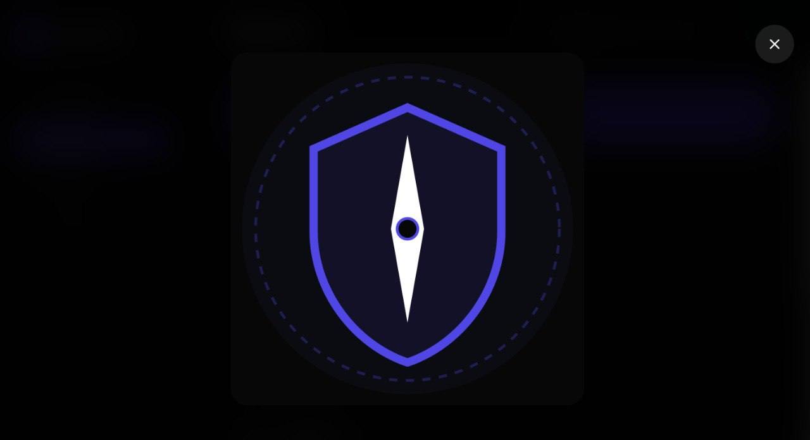
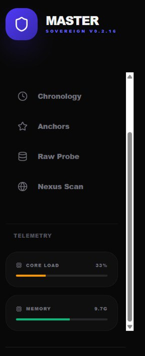
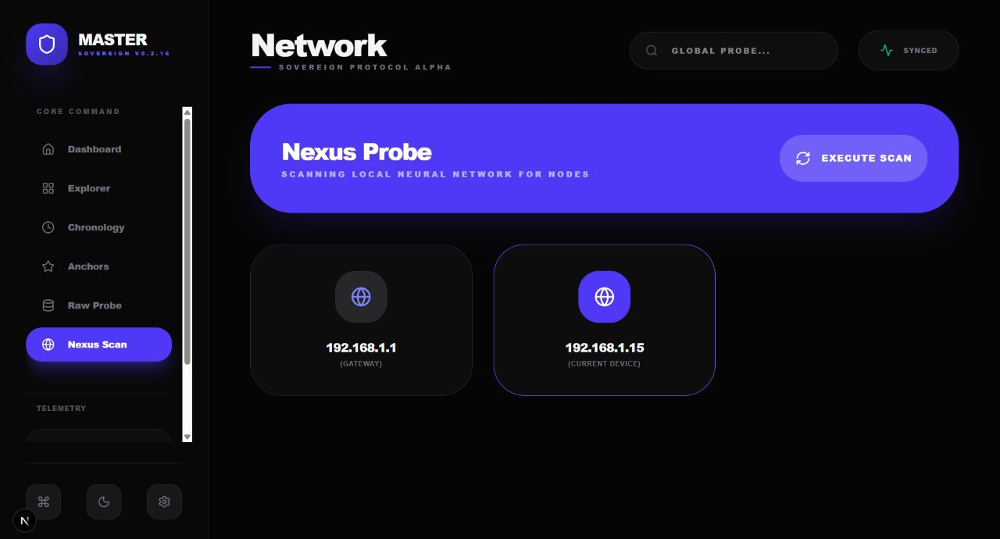

<div align="center">
  
  <h1>🧭 Master Browser</h1>
  <p><b>Universal User-Space Filesystem Bridge (Tauri + Rust)</b></p>
  <p><i>Explore and operate across NTFS/FAT/ext-family style storage from one hardened desktop UI.</i></p>
</div>

---

## What is Master Browser?

**Master Browser** is a native desktop file operations app built with **Rust + Tauri + Next.js** focused on:

- fast file navigation,
- low-level raw partition inspection,
- integrated terminal execution,
- in-app code/text editing,
- production-safe daily operations (copy/move/delete/rename/create).

No mock data paths are used for core actions — operations are wired to real backend commands.

---

## 📸 Screenshots

> Place screenshots in `docs/images/` with these exact names.

| Dashboard | Explorer |
| :---: | :---: |
|  |  |

| Editor | Terminal |
| :---: | :---: |
|  |  |

| Media Viewer |
| :---: |
|  |

### Legacy/Planned UI (from previous iterations)

| Legacy Sidebar (Chronology/Anchors) | Legacy Nexus Scan |
| :---: | :---: |
|  |  |

> Note: these legacy views are not fully wired in the current stable build yet.

---

## ✅ Core Features

### 1) Filesystem Explorer
- Navigate directories with direct path input.
- Multi-select with:
  - `Ctrl/Cmd + Click` → toggle item selection
  - `Shift + Click` → range selection
- Actions:
  - copy / move / paste
  - delete
  - rename
  - create file
  - create folder
- Right-click context menu (Explorer):
  - Open, Rename, Copy, Move, Delete, New File, New Folder, Paste.

### 2) Integrated Editor
- Monaco-based editor with syntax support for common source/text formats.
- Dirty-state tracking (`SAVED / UNSAVED`).
- Unsaved-change leave confirmation.
- `Ctrl/Cmd + S` save shortcut.

### 3) Integrated Terminal
- In-app command execution from current explorer path.
- Command history via arrow keys.
- Run-state lock to avoid overlapping command issues.
- Terminal command cancellation for long-running commands.

### 4) Dashboard + Telemetry
- Drive cards with capacity/free-space indicators.
- Live status presentation in UI shell.

### 5) Raw Probe
- Raw block-device inspection flow integrated via Rust backend parser module.

---

## ⌨️ Keyboard Shortcuts

- `Ctrl/Cmd + K` → focus search
- `Ctrl/Cmd + S` → save active file (editor)
- `?` or `Ctrl/Cmd + /` → toggle shortcut panel
- `Esc` → close floating menus/panels
- `Arrow Up/Down` (terminal input) → command history
- `Enter` (terminal input) → execute command

---

## 🛠 Tech Stack

- **Backend:** Rust, Tauri, sysinfo, walkdir, zip, image, regex
- **Frontend:** Next.js, React, Tailwind CSS, Framer Motion, Monaco Editor

---

## 🚀 Getting Started

### Prerequisites

- Rust toolchain (`rustup`)
- Node.js 18+
- npm

### Install

```bash
git clone https://github.com/CrimsonDevil333333/master-browser.git
cd master-browser
npm install
npm install --prefix frontend
```

### Development

```bash
npm run tauri dev
```

### Production Build

```bash
npm run tauri build
```

---

## 🧩 Release Automation

GitHub Actions release pipeline runs on `v*` tags and builds for:
- macOS
- Ubuntu
- Windows

Releases are configured for **automatic publish** (non-draft).

---

## 🛡 Windows Note

For raw physical disk inspection features, launch with **Administrator** privileges.

---

Built by OpenClaw Swarm for Satyaa. 🦞
